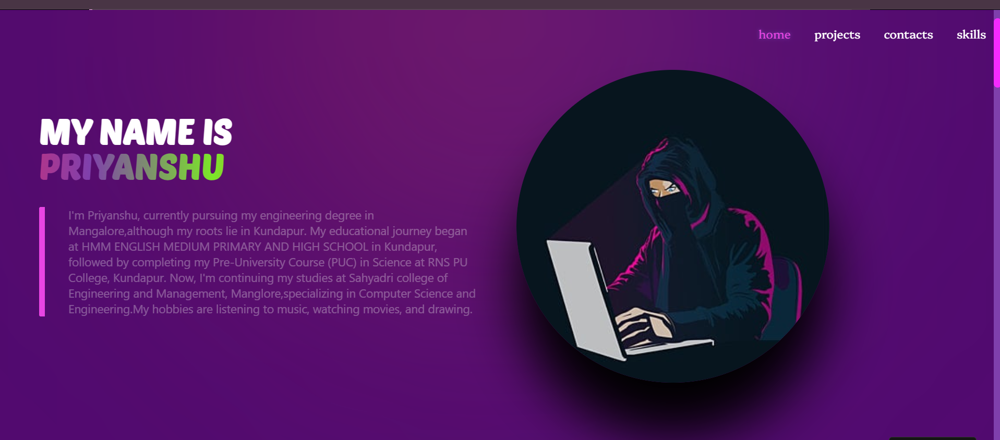

# 💼portfolio_react
A personal developer portfolio website built using **React** and **CSS** to showcase projects, skills, and contact information. The site highlights frontend skills and offers a clean, responsive design tailored for aspiring developers and job seekers.

---

## ✅ Features

### 🧑‍💻 About & Skills
- Personal introduction with brief bio
- Clearly structured **technical skills** and **soft skills**
- Icons and structured layout for readability

### 🛠️ Projects Showcase
- Lists of projects with:
  - Description
  - Tech stack 

### 📬 Contact Section
- Contact form (optional)
- Email and social media links

### 🎨 Design
- Responsive layout using custom CSS
- Gradient backgrounds and modern UI aesthetics
- Smooth scrolling and section navigation

---

## ⚙️ Tech Stack

- **Frontend:** React, JSX, CSS
- **Styling:** Custom CSS and Flexbox/Grid
- **Icons:** React Icons or custom images

---

## 🧪 Functional Highlights

- Component-based structure
- Clean layout with consistent theme

---

## 📸 Preview
|  |

---

